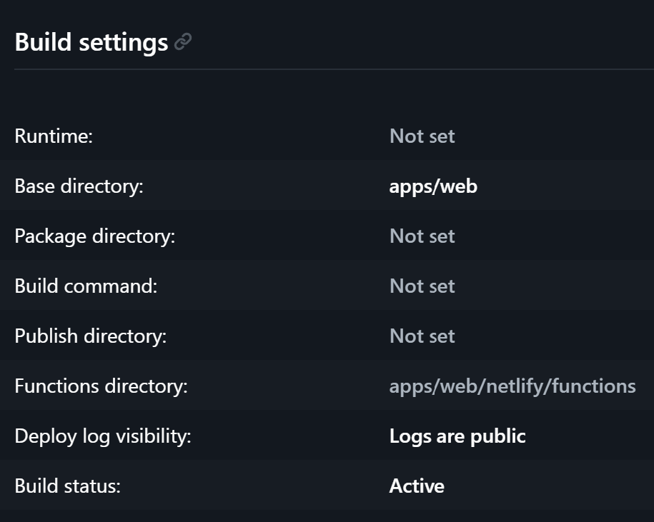

# tanstack-start-next

POC exploring TanStack Start limitations with a pnpm + Turborepo monorepo.

## Development

Requirements: Node >= 24, pnpm >= 10.

- Install: `pnpm install`
- Run the web app: `pnpm dev-web` (http://localhost:4000)
- Typecheck everything: `pnpm typecheck`
- Lint everything: `pnpm lint`

## Storybook

- Run the unified Storybook: `pnpm dev-storybook` (http://localhost:6006)

## Design system

UI components come from [Intent UI](https://intentui.com), installed via the shadcn CLI into `packages/intent-ui`. Consumers (`apps/web`, modules) import them as `@/components/ui/<name>`.

### Add a new Intent UI component

From `apps/web/`:

```
pnpx shadcn@latest add @intentui/<name>
```

The file lands at `packages/intent-ui/src/components/ui/<name>.tsx`. Import via `@/components/ui/<name>`.

### Add a new module

1. Create `modules/<name>/` with a `package.json` named `@modules/<name>` (private, workspace version, `type: "module"`).
2. Declare `@packages/intent-ui` as a workspace dependency if the module uses design-system components.
3. If the module exposes routes, export a single `create<Name>Routes(parentRoute)` factory from its entry point and call it from `apps/web/src/router.tsx` — spread its return into `rootRoute.addChildren([...])`. See `modules/demo` for the reference shape.
4. Import into `apps/web` where it's needed.

Modules do not configure Tailwind and do not import CSS — the host app handles both. The app's `apps/web/src/styles.css` already has an `@source` glob covering `modules/*/src/**`; new modules are picked up automatically.

### Add a new storybook app

1. Scaffold under `apps/<module>-storybook/`.
2. Install `@tailwindcss/vite`.
3. Register the plugin in the storybook's Vite config.
4. Create a root CSS that imports `@packages/intent-ui/globals.css` and declares `@source` globs for the storybook's own src and the module(s) it loads.
5. Import that CSS in `.storybook/preview.ts`.

## Netlify

- Make sure that in the Netlify site, the base directory is `apps/web/`:



- Set `DATABASE_URL` and `DATABASE_URL_POOLER` in the site's environment variables (same values as the local `.env.local`).

## Database

The demo module persists todos in a Neon Postgres database via Prisma. Schema, migrations, and seed live in `modules/demo/prisma/`. All `pnpm prisma-*` scripts must be run from `modules/demo/`.

Assumes a single shared Neon database — no per-contributor branching convention yet.

### First-time setup

1. Create a project at [neon.tech](https://neon.tech) and copy the two connection strings (direct + pooled).
2. Create `.env.local` at the repo root:

    ```
    DATABASE_URL=<direct connection string>
    DATABASE_URL_POOLER=<pooled connection string>
    ```

    Migrations require the direct URL (PgBouncer transaction pooling breaks DDL); runtime uses the pooled URL.

3. From `modules/demo/`: `pnpm prisma-migrate` to apply migrations.
4. Optional — seed demo data: `pnpm prisma-seed`.

### Schema changes

1. Edit `modules/demo/prisma/schema.prisma`.
2. From `modules/demo/`: `pnpm prisma-migrate` — creates the migration, applies it, regenerates the client.
3. Commit the new folder under `modules/demo/prisma/migrations/`.

### Production migrations

Run `pnpm prisma-migrate-deploy` from `modules/demo/` against the production Neon branch. Deliberately manual, not wired into the Netlify build: the build runs in `apps/web` and has no knowledge of `modules/demo`'s Prisma scripts, and auto-applying DDL during a routine site deploy is the wrong default.

## Limitations

### Code-based routing

TanStack Start's default file-based route generator scans a single directory (`apps/web/src/routes/`) and does not cross workspace boundaries on its own. A module defined under `modules/<name>/` cannot contribute file-based routes through the default generator. The sanctioned escape hatch is [virtual file routes](https://tanstack.com/router/latest/docs/framework/react/routing/virtual-file-routes) — `virtualRouteConfig` in `tsr.config.json` with the `physical()` helper can mount route directories from anywhere, including sibling workspaces. That path was not taken here (it carries its own rough edges under pnpm — see [TanStack/router#4984](https://github.com/TanStack/router/issues/4984)); instead the repo disables `enableRouteGeneration` and assembles the entire route tree in code. Every feature (app-local or module) exposes a `create<Feature>Routes(parentRoute)` factory that `apps/web/src/router.tsx` composes:

```ts
// apps/web/src/router.tsx
rootRoute.addChildren([createHomeRoute(rootRoute), ...createDemoRoutes(rootRoute)]);
```

Given that choice, every item below is a downstream consequence.

#### File-based + code-based cannot be mixed safely

Ruling out "just use file-based for the app and code-based for modules": [TanStack/router#2154](https://github.com/TanStack/router/issues/2154) reports that the type registry (generated from the file tree) doesn't pick up code-based routes added via `addChildren`. `<Link to="...">` autocomplete and typed `useParams` silently drop those routes from the union. No warning, no type error — it compiles. The issue was closed by the reporter without a fix PR; the architecture (generated `routeTree.gen.ts` from files only) inherently excludes `addChildren` routes, and virtual routes are the sanctioned way to bring them into the registry. Fully code-based or fully file-based (incl. virtual); no ad-hoc mixing.

#### Every route is manual

`getParentRoute`, `addChildren`, lazy wiring via `.lazy(() => import(...).then(d => d.Route))`, and `declare module "@tanstack/react-start"` / `Register` augmentation are all hand-written. File-based scaffolding is gone.

#### No automatic code-splitting

File-based routing splits by default. Code-based doesn't. Every split is explicit — `.lazy(...)` per route, or nothing.

#### TS compiler slows as the route tree grows

Code-based routing relies on inference through `getParentRoute()` chains — confirmed by the maintainers as existing primarily for TypeScript typing inference ([discussion #585](https://github.com/TanStack/router/discussions/585)). File-based codegen short-circuits that work by emitting a concrete `routeTree.gen.ts`. TanStack Router has documented TS-perf gotchas on the consumer side (e.g. [#1091](https://github.com/TanStack/router/issues/1091)), and directionally, deeper `getParentRoute` chains mean more inference per file; we haven't benchmarked it here.

#### Route id quirks that must be tracked manually

Two cases where the route id diverges from what a reader would expect, and the lazy side has to match it character-for-character:

- **Index routes** (`path: "/"` under a parent) have ids with a trailing slash (`/todos/`). `createLazyRoute("/todos/")` needs the slash; `createLazyRoute("/todos")` silently doesn't match.
- **Pathless layout routes** (declared with `id: "_foo"` instead of `path`) contribute nothing to the URL but their id is prepended to every descendant's route id — see the pathless-layout workaround below.

Both fail at runtime with "Failed to fetch dynamically imported module" — not at build time.

#### Loader data types don't reach lazy routes

`useLoaderData()` in a `*.lazy.tsx` file returns `unknown`. The route's loader return type doesn't propagate from the registered `routeTree` through to lazy consumers. Same root cause as [TanStack/router#2154](https://github.com/TanStack/router/issues/2154) above (the type registry was designed around file-based codegen), surfaced on the data side instead of the link side: trees assembled via `addChildren` aren't fully visible to the lookups TSR performs for `useLoaderData`. Tracked in [TanStack/router discussions#1732](https://github.com/TanStack/router/discussions/1732).

Alternatives that don't fix it:

- `getRouteApi(id).useLoaderData()` — same registry gap, same `unknown`.
- `RouteById<RegisteredRouter["routeTree"], id>["types"]["loaderData"]` — reaches into internal types not covered by semver, and still resolves through the same broken registry.
- Casting consumers to a raw Prisma model type (`as TodoModel`) — couples every consumer to the schema, so any `select`/`include` narrowing silently becomes a lie.

See the workaround below.

#### Production build fails: manifest plugin requires a generated route tree

`pnpm build-web` fails in the SSR phase with:

```
[plugin tanstack-start:start-manifest-plugin]
TypeError: Cannot convert undefined or null to object
    at Object.entries (<anonymous>)
    at buildRouteManifestRoutes (.../start-manifest-plugin/manifestBuilder.js:171)
```

The plugin does `Object.entries(options.routeTreeRoutes)`. With `enableRouteGeneration: false`, no `routeTree.gen.ts` is produced, `routeTreeRoutes` is `undefined`, and the plugin crashes. Client bundle completes; only the SSR environment blows up. Same `vite build` runs locally, via `netlify deploy --build`, and in Netlify CD — so `pnpm build-web`, `pnpm deploy-web`, and Git-based deploys all fail at the same point. Upstream: [TanStack/router#5808](https://github.com/TanStack/router/issues/5808), closed as not planned.

No workaround for a POC. Shipping requires switching to file-based routing (gives up cross-workspace routes) or virtual file routes (the sanctioned alternative, mentioned above). Until one of those, builds don't produce artifacts.

## Issues encountered

### shadcn

Multiple issues with the CLI:

- https://github.com/shadcn-ui/ui/issues/10461
- https://github.com/shadcn-ui/ui/issues/10462
- https://github.com/shadcn-ui/ui/issues/8991

### Tanstack Start

- https://github.com/TanStack/router/discussions/3449 (also https://developers.netlify.com/sdk/edge-functions/get-started#limitations)

Netlify function error:

```
The error is: Apr 21, 10:51:25 PM: c3d83970 ERROR  Invoke Error     {"errorType":"Error","errorMessage":"Cannot find package '@tanstack/react-router' imported from                         /var/task/apps/web/.netlify/v1/functions/server.mjs","code":"ERR_MODULE_NOT_FOUND","stack":["Error [ERR_MODULE_NOT_FOUND]: Cannot find package '@tanstack/react-router' imported from       /var/task/apps/web/.netlify/v1/functions/server.mjs","    at Object.getPackageJSONURL (node:internal/modules/package_json_reader:314:9)","    at packageResolve                             (node:internal/modules/esm/resolve:774:81)","    at moduleResolve (node:internal/modules/esm/resolve:861:18)","    at moduleResolveWithNodePath                                             (node:internal/modules/esm/resolve:991:14)","    at defaultResolve (node:internal/modules/esm/resolve:1034:79)","    at #cachedDefaultResolve                                               (node:internal/modules/esm/loader:731:20)","    at ModuleLoader.resolve (node:internal/modules/esm/loader:708:38)","    at ModuleLoader.getModuleJobForImport                               (node:internal/modules/esm/loader:310:38)","    at ModuleJob._link (node:internal/modules/esm/module_job:182:49)"]}
```

Bottom line... to deploy with the Netlify CLI, it would requires to somehow pre-build the server functions with something like tsdown or set `ssr.noExternal: true` in vite config, which have it's own downsides as well. Git-based CD has the same issue — it runs the same `vite build` command.

Note: this `ERR_MODULE_NOT_FOUND` is a **runtime** failure, downstream of a successful build producing a `server.mjs`. Currently the build itself fails earlier (see the manifest-plugin limitation under Code-based routing), so this runtime error isn't reached today.

### Tanstack Router

- Pathless layout route ids silently become part of every descendant's route id. A child's `createLazyRoute(...)` must include the pathless segment — e.g. `createLazyRoute("/todos/_todosLayout/$todoId")`, not `createLazyRoute("/todos/$todoId")`. Mismatched ids fail at runtime with "Failed to fetch dynamically imported module". The URL path is unchanged; only the route id shifts.

### Vite

- 504 Outdated Optimize Dep on lazy-route navigation: https://github.com/vitejs/vite/issues/22303

### Storybook

Issues with `storybook-addon-tanstack-start`:

- https://github.com/jonmumm/storybook-addon-tanstack-start/issues/7 — addon excludes `@tanstack/react-router` from `optimizeDeps`, which cascades into `use-sync-external-store/shim/with-selector` being served as raw CJS and failing the browser's named-import parse under pnpm.
- https://github.com/jonmumm/storybook-addon-tanstack-start/issues/8 — the root barrel transitively imports `plugin.mjs`, whose top-level `fileURLToPath(import.meta.url)` runs in the browser and throws. Workaround: import `tanstackRouterParameters` from `storybook-addon-tanstack-router` directly.

`storybook-addon-tanstack-start` doesn't support stubbing any server function:

- `createServerFn` stubs throw unconditionally and there is no documented per-story override. Stories can render with mocked loader data, but click/interaction flows that invoke server functions are a dead end without refactoring the component to expose a mockable boundary.

### Intent UI

Issues:

- Docs is outdated for Tanstack Router link support: https://github.com/intentui/intentui/issues/629

## Workarounds

Every subsection below is a live workaround this repo carries to build, run, or deploy. They map 1:1 to the issues above.

### shadcn multi-segment scope import paths (shadcn-ui/ui#10462)

The CLI builds import paths from `components.json` aliases; multi-segment scopes like `@packages/intent-ui` confuse it. Alias `@/` to the design-system's src in **every** tsconfig in the repo, overriding the "this workspace's src" convention:

```json
// apps/web/tsconfig.json, modules/demo/tsconfig.json
"paths": {
    "@/*": ["../../packages/intent-ui/src/*"]
}
```

```json
// packages/intent-ui/tsconfig.json
"paths": {
    "@/*": ["./src/*"]
}
```

Every new workspace needs this line or files generated by the CLI will have unresolvable imports.

### shadcn ignores `rsc: false` (shadcn-ui/ui#8991)

`components.json` has `"rsc": false` but the CLI still writes `"use client"` directives at the top of every generated file:

```tsx
// packages/intent-ui/src/components/ui/link.tsx (and every other UI component)
"use client";

import { Link as LinkPrimitive, ... } from "react-aria-components/Link";
```

Left in place — the directive is a no-op in this non-RSC setup, and scrubbing it after every `add` is more friction than value. Just noise every code reviewer has to ignore.

### TanStack Start + Netlify CLI deploy (TanStack/router#3449)

Local `netlify deploy` errors because the built server function can't resolve `@tanstack/react-router` under pnpm's isolated layout:

```
Error [ERR_MODULE_NOT_FOUND]: Cannot find package '@tanstack/react-router'
  imported from /var/task/apps/web/.netlify/v1/functions/server.mjs
```

No code fix applied. The "workaround" is procedural: **use Netlify continuous deployment only**. Alternatives (`tsdown` pre-build of the server fn, `ssr.noExternal: true` in Vite config) each introduce their own regressions.

### Netlify Vite plugin in dev

The Netlify Vite plugin reads the linked site's `base = apps/web` and joins it against the current working directory, producing `apps/web/apps/web` and aborting the dev server. Gated by Vite command:

```ts
// apps/web/vite.config.ts
export default defineConfig(() => ({
    plugins: [
        tailwindcss(),
        tanstackStart({ router: { enableRouteGeneration: false } }),
        viteReact(),
        netlify() // gated elsewhere in the config to command === "build"
    ]
}));
```

A plugin that aborts by default in dev, gated by a string comparison, is not a normal shape for Vite configuration.

### TanStack Router pathless layout route ids

Pathless layout routes (declared with `id: "_foo"` instead of `path`) contribute nothing to the URL, but their id **silently becomes part of every descendant's route id**. The lazy side must hard-code that segment or fail at runtime. Applied to every lazy route under `modules/demo/src/todos/`:

```ts
// modules/demo/src/todos/createTodosRoutes.tsx
const todosLayoutRoute = createRoute({
    getParentRoute: () => todosRoute,
    id: "_todosLayout",
    component: TodosLayout
});
```

```ts
// modules/demo/src/todos/TodoEdit.lazy.tsx
// URL is /todos/:todoId/edit. Route id is /todos/_todosLayout/$todoId/edit.
export const Route = createLazyRoute("/todos/_todosLayout/$todoId/edit")({
    component: TodoEdit
});
```

The URL and the id diverge. If someone refactors the layout id or removes the pathless wrapper, every descendant's lazy id must be updated by hand or navigation breaks with "Failed to fetch dynamically imported module".

### Loader data types via a per-route type alias

`useLoaderData()` in a lazy route returns `unknown` in this repo (see the Limitations entry). Since the registry-based fixes don't help and casting to a Prisma type couples consumers to the schema rather than the query, we derive the type from the server function itself and export it from the critical file:

```tsx
// modules/demo/src/todos/TodosList.tsx (critical)
export const getTodos = createServerFn({ method: "GET" }).handler(() => {
    return prisma.todo.findMany({ orderBy: { createdAt: "asc" } });
});

export type TodosLoaderData = Awaited<ReturnType<typeof getTodos>>;
```

```tsx
// modules/demo/src/todos/TodosList.lazy.tsx (lazy)
import type { TodosLoaderData } from "./TodosList.tsx";

const todos = routeApi.useLoaderData() as TodosLoaderData;
```

Narrowing the query (adding `select`, `include`) narrows `TodosLoaderData` automatically, so every consumer's cast stays honest without manual edits. Every new route with a loader carries its own `<Name>LoaderData` export. When TSR's registry learns to resolve loader types through `addChildren`-built trees, the cast goes away everywhere.

### Vite 504 Outdated Optimize Dep (vitejs/vite#22303)

Lazy-route navigations discover new `react-aria-components/*` subpaths, Vite's optimizer re-bundles mid-session, and in-flight module requests 504. Counter: enumerate every subpath used anywhere in the app up-front so the optimizer sees the full set at boot:

```ts
// apps/web/vite.config.ts
optimizeDeps: {
    include: [
        "react-aria-components/Breadcrumbs",
        "react-aria-components/Button",
        "react-aria-components/FieldError",
        "react-aria-components/Group",
        "react-aria-components/Input",
        "react-aria-components/Label",
        "react-aria-components/Link",
        "react-aria-components/Text",
        "react-aria-components/TextField",
        "react-aria-components/composeRenderProps",
        "@heroicons/react/24/solid"
    ];
}
```

Same failure mode applies to `@heroicons/react` subpaths (`/24/solid`, `/24/outline`, `/20/solid`) — each one first reached via a lazy navigation triggers the same 504. Every new react-aria-components or heroicons subpath added anywhere in the app must also be added to `include`, or a lazy navigation deep in the tree will surface a 504 long after the PR merges.

Under pnpm's isolated layout there's a second trap: `optimizeDeps.include` silently no-ops for specifiers that can't be resolved from the app's root. `@heroicons/react` is a dep of `@packages/intent-ui`, not `apps/web`, so no symlink exists at `apps/web/node_modules/@heroicons/` and the pre-bundle scan drops the entry without warning. Lazy navigation through a component that renders breadcrumbs then _discovers_ it for the first time, triggers re-optimization, invalidates the browser's in-flight `?v=` hashes, and surfaces the 504. Counter: declare the transitive design-system dep as a direct dep of `apps/web` so pnpm materializes the link:

```jsonc
// apps/web/package.json
"dependencies": {
    "@heroicons/react": "2.2.0",
    ...
}
```

Same rule as the `use-sync-external-store` workaround below — anything listed in `optimizeDeps.include` must also be reachable from the workspace doing the optimizing. Both pieces are needed: the `include` entry tells the optimizer to pre-bundle the subpath, and the direct dep tells pnpm to make it resolvable.

### Storybook addon pre-bundles break in pnpm (jonmumm/storybook-addon-tanstack-start#7)

The addon puts `@tanstack/react-router` in `optimizeDeps.exclude`, which cascades into the transitive `use-sync-external-store/shim/with-selector` being served as raw CJS. Under pnpm that module isn't hoisted as a direct bare specifier, so a plain `optimizeDeps.include` entry alone can't resolve it. Two edits, both in `apps/storybook-demo/`:

```jsonc
// apps/storybook-demo/package.json
"dependencies": {
    "use-sync-external-store": "1.6.0",
    ...
}
```

```ts
// apps/storybook-demo/vite.config.ts
optimizeDeps: {
    include: ["use-sync-external-store/shim/with-selector"];
}
```

A direct dep on a transitive CJS helper of a transitive dep of a Storybook addon. That's the level at which the stack requires intervention.

### Storybook addon root barrel pulls Node into browser (jonmumm/storybook-addon-tanstack-start#8)

The addon's root barrel `storybook-addon-tanstack-start` transitively imports `plugin.mjs`, whose module top-level calls `fileURLToPath(import.meta.url)` — a Node API externalized (and broken) in the browser. The addon's subpath exports (`/plugin`, `/preview`, `/stubs`) don't expose `tanstackRouterParameters`, so reaching it without the barrel means importing from the underlying package:

```tsx
// modules/demo/src/counter/Counter.stories.tsx
// NOT: import { tanstackRouterParameters } from "storybook-addon-tanstack-start"
import { tanstackRouterParameters } from "storybook-addon-tanstack-router";
```

```jsonc
// modules/demo/package.json — story file lives here, so the dep must live here too
"devDependencies": {
    "storybook-addon-tanstack-router": "0.1.0",
    ...
}
```

The dep has to be declared in **the module that owns the story**, not the Storybook app, because Vite resolves bare specifiers relative to the source file's workspace. Not obvious, and trips up anyone following the Storybook app conventions for addon setup.

### Storybook addon `createServerFn` stubs throw unconditionally

No workaround exists. The addon's default stub is hardcoded to throw, and there is no documented per-story override API:

```ts
// node_modules/storybook-addon-tanstack-start/dist/mocks/start-stubs.mjs
const createServerFn = () => {
    const builder = {
        ...
        handler: () => async () => {
            throw new Error("createServerFn not available in Storybook");
        }
    };
    return builder;
};
```

Click/interaction stories for Start-backed components are simply not built. Loader-driven render stories work; that's where the capability ends.

### Intent UI docs outdated for TanStack Router (intentui/intentui#629)

The docs describe a TSR integration API that no longer matches reality. We stopped consulting them and read `react-aria-components` source directly to confirm the generated `Link` already works, then wire TSR on top at the call site:

```tsx
// packages/intent-ui/src/components/ui/link.tsx (stock, unmodified)
import { Link as LinkPrimitive } from "react-aria-components/Link";
export function Link({ ... }: LinkProps) { return <LinkPrimitive ... />; }
```

```tsx
// modules/demo/src/todos/TodoEdit.lazy.tsx — wrap at use-site
import { createLink } from "@tanstack/react-router";
import { Link as IntentLink } from "@/components/ui/link.tsx";
const Link = createLink(IntentLink);
```

The docs being wrong means every TSR + Intent UI integration discovery is done by reading source. That cost is ongoing — it applies to every new component, not just `Link`.
